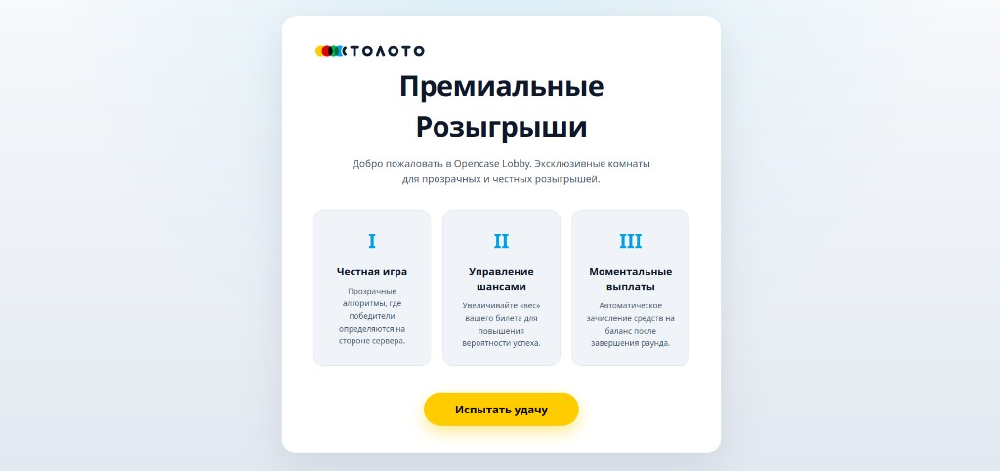

# Stoloto Mini-Games Platform — Opencase Module



Текущий репозиторий содержит мини-игру `Opencase` — первую из трех мини-игр, которые будут объединены в единый игровой проект.

## Стек

- Backend: Python 3.11 + FastAPI
- Database: SQLite (aiosqlite)
- Frontend: React + Vite
- Realtime: WebSocket

## Быстрый старт

### 1) Установка зависимостей

```bash
python -m venv venv
source venv/bin/activate  # Windows: venv\Scripts\activate
pip install -r requirements.txt
```

### 2) Инициализация БД и демо-данных

```bash
python -m app.seed
```

### 3) Сборка фронтенда

```bash
cd frontend-react
npm install
npm run build
cd ..
```

### 4) Запуск backend

```bash
uvicorn app.main:app --reload --host 0.0.0.0 --port 8000
```

### 5) Открыть приложение

- Лобби: `http://localhost:8000/`
- Профиль: `http://localhost:8000/profile`
- Админка: `http://localhost:8000/admin`

## Интеграция без сюрпризов

- Backend отдает уже собранный frontend из `frontend-react/dist`.
- После любых изменений в `frontend-react/src` обязательно выполняйте `cd frontend-react && npm run build`.
- Контракт рулетки сервер-авторитетный: клиент не вычисляет победителя, а только рендерит `ROUND_RESULT`.
- Для восстановления состояния при reload во время спина используйте поле `active_spin` из `GET /api/rooms/{room_id}`.
- WebSocket подключение: `ws://localhost:8000/ws/room/{room_id}?user_id={id}` (или `wss://` на HTTPS).

## Что реализовано

- Лобби с фильтрами, созданием комнат и входом.
- Комната с realtime-обновлением участников.
- Сервер-авторитетная рулетка:
  - победитель и лента считаются на backend,
  - frontend только визуализирует `winIndex` и `laneStrip`.
- Буст шанса:
  - покупка 1 раз на участника,
  - визуальные эффекты для boosted-пользователя.
- Аватары и имена:
  - реальные игроки отображаются по `username`,
  - боты получают псевдослучайные имена,
  - аватары используются в комнате, рулетке и профиле.
- Профиль пользователя:
  - баланс,
  - количество игр/побед,
  - история раундов.
- Эффекты победы:
  - count-up баланса,
  - overlay победителя,
  - rain эффект монет.
- Админка:
  - глобальный шаблон для будущих комнат,
  - редактирование конкретных комнат в статусе `WAITING`.

## Админ-панель

В админке есть 2 независимых блока:

1. **Редактирование конкретных комнат**
   - источник: `GET /api/admin/rooms`
   - сохранение: `PUT /api/admin/rooms/{room_id}/config`
   - ограничение: редактируются только комнаты `WAITING`
2. **Шаблон для новых комнат**
   - источник: `GET /api/admin/config`
   - сохранение: `POST /api/admin/config`
   - применяется к новым комнатам, которые создаются после удаления старых.

## API (актуально)

- `GET /api/rooms` - список комнат, фильтры: `entry_fee_min`, `entry_fee_max`, `seats_min`, `seats_max`, `tier`, `status`
- `GET /api/rooms/{room_id}` - детали комнаты; при `status=running` может содержать `active_spin` для восстановления спина после refresh
- `POST /api/rooms?creator_id={user_id}` - создать комнату
- `POST /api/rooms/{room_id}/join` - вход, body: `{ "user_id": number }`
- `POST /api/rooms/{room_id}/leave` - выход, body: `{ "user_id": number }`
- `POST /api/rooms/{room_id}/boost` - купить буст, body: `{ "user_id": number }`
- `GET /api/users/{user_id}/active-room`
- `GET /api/users/{user_id}/profile?limit=20`
- `GET /api/admin/config`
- `POST /api/admin/config/validate`
- `POST /api/admin/config`
- `GET /api/admin/rooms`
- `PUT /api/admin/rooms/{room_id}/config`
- `GET /api/history?limit=50&room_id={id}`

## WebSocket

URL:

```text
ws://localhost:8000/ws/room/{room_id}?user_id={id}
```

События:

- `TIMER_TICK`
- `BOTS_ADDED`
- `PARTICIPANTS_SYNC`
- `ROOM_LOCKED`
- `ROUND_RESULT` (серверная лента и winIndex)
- `ROUND_FINISHED`

### Полезные payload-поля для интеграции

- `ROUND_RESULT.data.winIndex`: индекс победного слота в ленте.
- `ROUND_RESULT.data.laneStrip[]`: готовая лента для рендера (порядок уже финальный).
- `ROUND_FINISHED.data.awardedAmount`: сумма зачисления победителю (0 для бота).
- `TIMER_TICK.data.secondsLeft`: обратный отсчет комнаты до старта.
- `PARTICIPANTS_SYNC.data.participants[]`: актуальный состав участников.

## Важные замечания по рулетке

- Источник истины - backend.
- Frontend не вычисляет победителя.
- Визуальные эффекты финиша синхронизированы с фактическим окончанием анимации ленты.
- Длительность спина регулируется в `frontend-react/src/features/room/components/CaseRoulette.tsx`:
  - `MAIN_SPIN_MS`
  - `SETTLE_MS`
  - `slowdownLeadMs` (момент включения тряски до остановки)

## Структура проекта

```text
app/
  main.py
  models/models.py
  schemas/
  services/
  ws/manager.py

frontend-react/
  src/
    app/
    features/
      admin/
      lobby/
      profile/
      room/
```

## Статус

Модуль `Opencase` готов к локальной демонстрации и интеграции как часть будущей мульти-игровой платформы.
